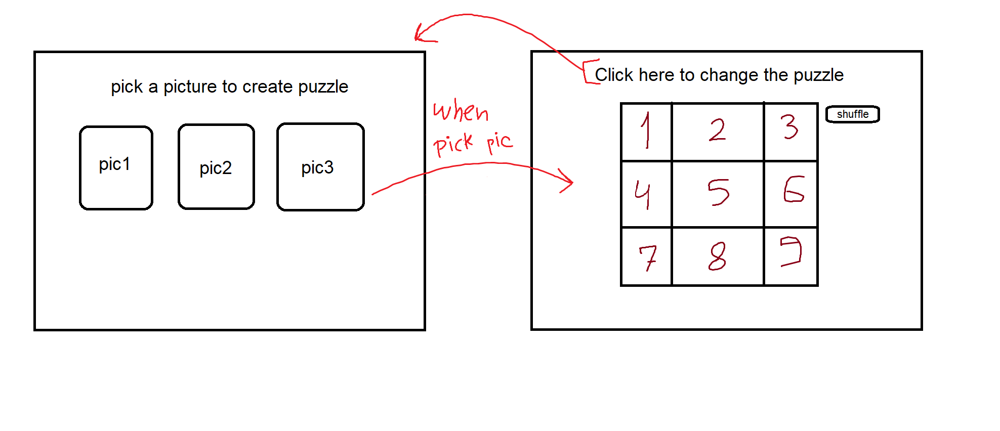

# Puzzle
<small style="color: gray">This was work from <span title="General Assembly">GA</span></small>
## INTRODUCTION
this repo project is about a game called **'Puzzle'** is to be sorted after picking the wanted picture, and transfer it to a puzzle.<br>
This project is required to complete the JDI course from Misk Academy and General Assembly by work individually to get practice of some covered materials taken so far for now. 

---
## TECHNOLOGIES
* HTML 5
* CSS 3 
* JQuery 3.5.1

---
## PROGRAM USED
* VS Code - 2020

---
## GAME
To play this game, the user has to choose one of the pictures to start to play the **Puzzle** game with size 3*3. To play, you have to press the **shuffle** button to shuffle and start playing and arrange the puzzle.

---
## WIREFRAME AND USER STORY
 
* As a user, I want to change the picture of puzzle.
* As a user, I want to reshuffle the puzzle.

---
## FEATURES
* Pick the puzzle you want to play with.
* Shuffle the puzzle many times.

---
## INSTALATION INSTRCUTIONS
1. Fork 
2. Clone 
    * ```$ git clone URL```
3. Add the changes 
    * ```$ git add .```
4. Save changes 
    * ```$ git commit -m "mgs"```
5. Push work into Github 
    * ```$ git remote add origin BRANCH```
    * ```$ git push -u origin BRANCH```
6. Pull request
    * create a pull request in Github site


## FAVORITE FUNCTION
There are 3 functions, and I find the **moveSquare** is the favorite, it starts with taking an argument when clicking on the square. In case you clicked on the white square nothing will happen, you have to click on the one with the image. It'll try to detect if the white square is up, down, left, or right by comparing the rows and columns. Once it knows it was near the clicked square (on right, left, up, down of the clicked square), it'll move, otherwise, nothing will happen.


